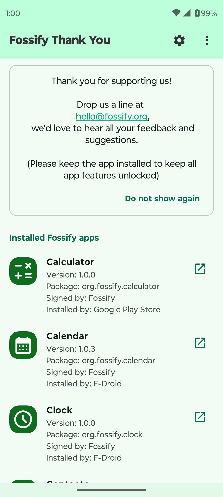
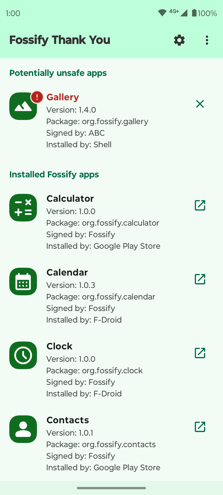
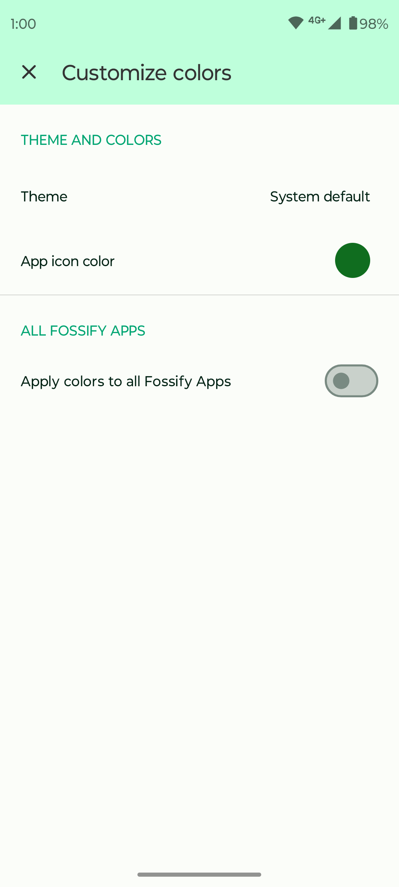

# Fossify Thank You

If you like our apps which are free, non-intrusive and have no ads, please consider supporting us in some way. It will be hugely appreciated.

Having this app installed will unlock every feature, allow color customization and prevent the displaying of a "Donate please" dialog in the free apps. Other than that, it also allows using a Shared Theme, which means that as soon as you change a color in one app, all other apps will be updated. Newly installed apps from the suite will automagically receive the shared colors too.

Please keep the app installed at least for a day, to avoid getting automatically refunded.

It comes with material design and dark theme by default, provides great user experience for easy usage. The lack of internet access gives you more privacy, security and stability than other apps.

Contains no ads or unnecessary permissions. It is fully opensource, provides customizable colors.

➡️ Explore more Fossify apps: https://www.fossify.org 
➡️ Open-Source Code: https://www.github.com/FossifyOrg 
➡️ Join the community on Reddit: https://www.reddit.com/r/Fossify 
➡️ Connect on Telegram: https://t.me/Fossify

